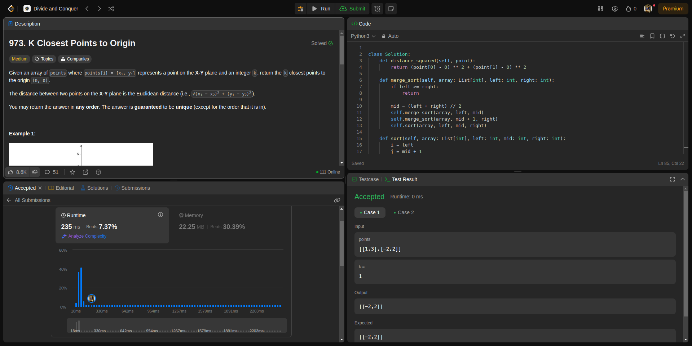
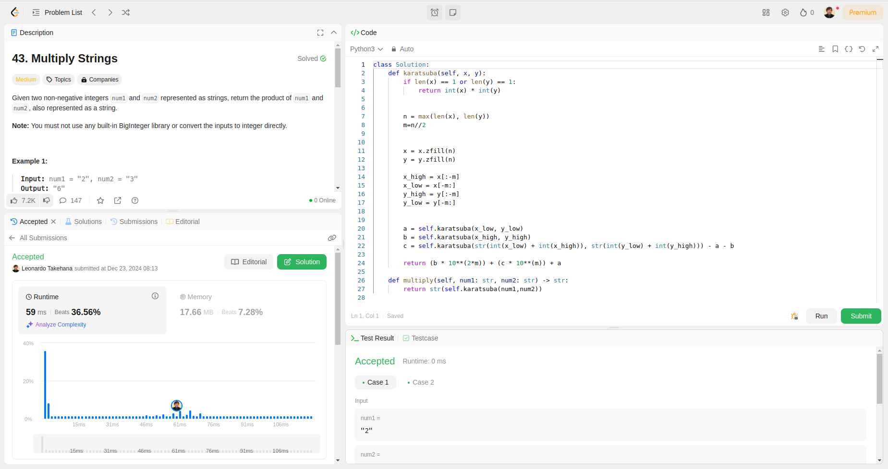
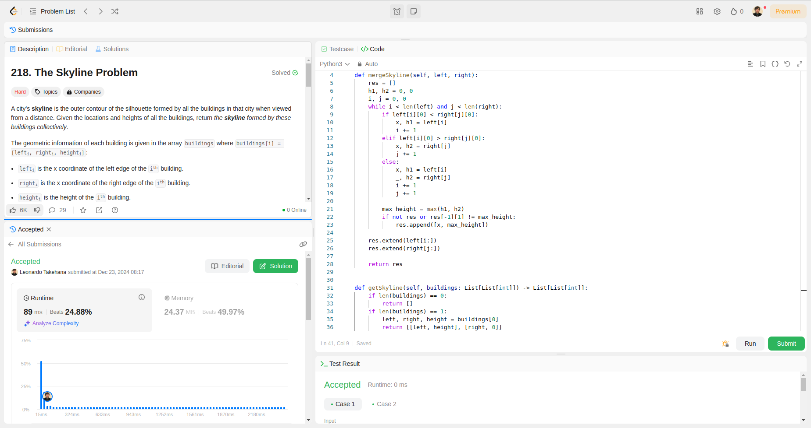
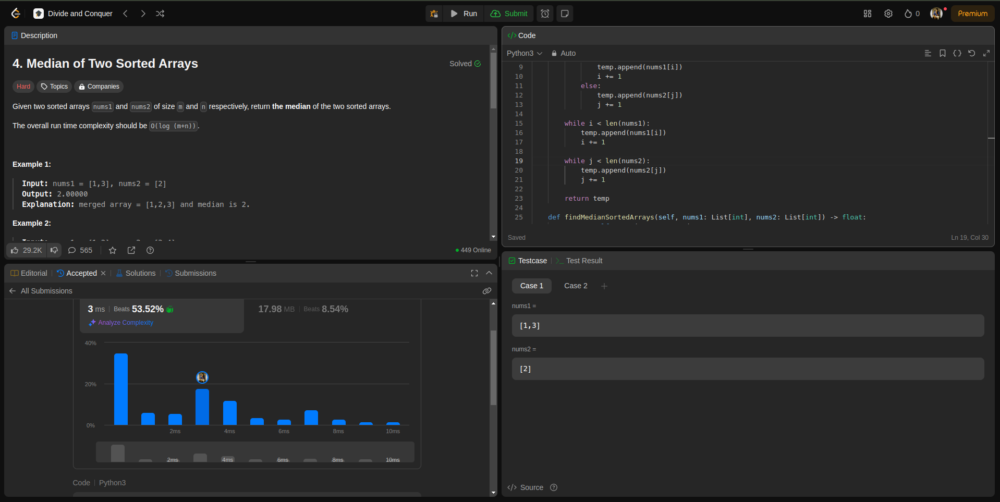

Temas:
 - Dividir e Conquistar
 
# DividirConquitar_LeetCode

**Número da Lista**: 10<br>
**Conteúdo da Disciplina**: Dividir e Conquistar<br>

## Alunos
|Matrícula | Aluno |
| -- | -- |
| 19/0094257  |  Paulo Henrique de O. Rezende |
| 23/2022952  |  Leonardo de Souza Takehana |

## Sobre 
O projeto é contemplado por resolver 3 questões da plataforma LeetCode, sendo 1 dífíceis e 2 médio. A definição de médio, fácil e difícil é concebida pela própria plataforma.

Para os exercícios serem realizados, usamos o algoritmo de mediana das medianas para encontrar o par de pontos mais próximos á origem, merge sort, o problema de skyline, que usa uma abordagem similar ao merge sort e o algoritmo de karatsuba, para que pudessem receber o Accept como solução para o desafio.

As questões foram escolhidas com base nos algoritmos merge sort, karatsuba e par de pontos mais próximos.

## Screenshots
Questão: [Médio - 973. K Closest Points to Origin](https://leetcode.com/problems/k-closest-points-to-origin/description/?envType=problem-list-v2&envId=divide-and-conquer)


Questão: [Médio - 43. Multiply Strings](https://leetcode.com/problems/multiply-strings/description/)


Questão: [Difícil - 218. The Skyline Problem](https://leetcode.com/problems/the-skyline-problem/description/)


Questão: [4. Median of Two Sorted Arrays](https://leetcode.com/problems/median-of-two-sorted-arrays/?envType=problem-list-v2&envId=divide-and-conquer)



## Instalação 
**Linguagem**: python<br>
**Framework**: Não será preciso<br>
Instalar uma versão lastest stable do python desde de que seja > 3.11.  

## Uso 
Para rodar este projeto, basta entrar na raiz do projeto e executar o arquivo referente a questão que se deseja avaliar, por exemplo:
```
python3 973.KClosestPointstoOrigin.py
```

## Outros
Desconsiderar a função </br>main()<br> dos arquivos .py ao tentar submeter ao leetcode. Esta função foi implementada apenas com o intuito de testar casos base.

## Vídeo
-

